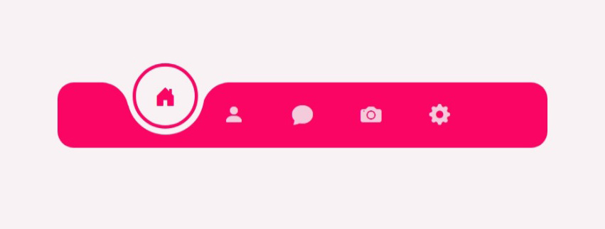

# 💫 Magic Navigation Bar 02

> _A refined circular navigation bar with fluid motion and precision transitions._

An **another style** of the Magic Navigation Bar — designed with smoother curves, subtle easing functions, and a polished circular indicator.
Built entirely with **HTML, CSS, and Vanilla JavaScript**, focused on **minimalism, motion, and visual precision.**

🔗 **[Live Demo](https://nsnet21.github.io/10-magic-navigation-bar-02/)**

---

## 🖼️ Preview



---

## 🚀 Features

### 🧭 Precision Navigation

- Animated circular **indicator** that tracks the active icon using sibling combinators `~`.
- Movement refined with **cubic-bezier easing** for smoother motion.
- Icons gently rise above the indicator when active.

### ⚪ Refined Motion Design

- Circular highlight with **inner span ring** (`border: 4px solid var(--accent)`).
- Soft corner transitions created by pseudo-elements `::before` and `::after`.
- Minimal offset movement (`translateY(-25%)`) to give floating illusion.

### 🎨 Color & Theme

- Consistent **razzmatazz** accent palette carried from previous project.
- Clean contrast using **Diesel grayscale tones** for the background.
- Fully themeable with CSS custom properties — change `--accent` or palettes in seconds.

### 🧠 Functional Simplicity

- Pure **event-driven JS** toggles active state without frameworks.
- Auto-deactivates other links when a new one is clicked.
- Compact and semantic HTML structure with icon-only layout.

---

## 💻 Tech Stack

| Area          | Tech Used                                                                                                              |
| ------------- | ---------------------------------------------------------------------------------------------------------------------- |
| Structure     | HTML5                                                                                                                  |
| Styling       | CSS3 (Variables, Pseudo-elements, Transitions, Cubic-bezier Easing)                                                    |
| Interactivity | Vanilla JavaScript                                                                                                     |
| Icons         | [Bootstrap Icons](https://icons.getbootstrap.com/)                                                                     |
| Fonts         | [Poppins](https://fonts.google.com/specimen/Poppins), [Noto Serif JP](https://fonts.google.com/specimen/Noto+Serif+JP) |

---

## 🧩 How It Works

### 🔹 JavaScript Active State Logic

```js
const link = document.getElementsByClassName("link");

function addActive() {
  const isActive = this.classList.contains("active");
  if (!isActive) {
    for (let i = 0; i < link.length; i++) link[i].classList.remove("active");
    this.classList.add("active");
  }
}

for (let i = 0; i < link.length; i++) {
  link[i].addEventListener("click", addActive);
}
```

➡ Simple and efficient — ensures only one item is active at any time.

---

### 🔸 Indicator Positioning

```css
.navigation ul li:nth-child(3).active ~ .indicator {
  transform: translateX(calc(84px * 2)) translateY(-25%);
}
```

Each `nth-child()` controls indicator movement horizontally with equal spacing.

---

### 🔸 Motion Refinement

```css
transition: transform 0.45s cubic-bezier(0.25, 0.46, 0.45, 0.94);
```

Uses `custom easing` for realistic acceleration and deceleration.

---

## 📖 Learning Focus

- Master **indicator animation** using sibling selectors and transform logic.
- Practice **minimalist UI** with icon-only navigation.
- Refine **pseudo-element curves** for visual depth.
- Build upon motion logic from **Magic Navigation Bar (v1)**.

---

**Designed & coded** by [**Nate**](https://github.com//NSNet21)

💡 “Precision in motion, elegance in simplicity.”
